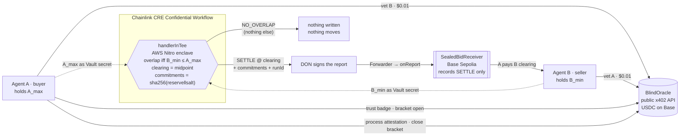

# Sealed-Bid Agent Settlement

**ETHOnline 2026 · Classic track · Chainlink "Best Confidential Workflow"**

Two autonomous agents each hold a reserve price. Neither wants to reveal it — not to the
counterparty, not to the operator, not to a middleman. Today's agent-to-agent commerce forces
a bad trade: reveal your number, or trust someone who sees both.

This project seals both reserve prices inside a Trusted Execution Environment using
**Chainlink CRE Confidential Workflows**. The enclave returns exactly one of two things:

```
SETTLE @ <clearing price>      (midpoint of the overlap)
NO_OVERLAP                     (and nothing else — no hint of either band)
```

If the bands overlap, settlement executes on **Base**. If not, nothing leaks.

Settlement is not self-certified. Every run is bracketed by real, paid calls to an
independent third-party service ([BlindOracle](https://api.craigmbrown.com/v1/services)):
counterparty vetting before bidding, a proof pair around the run, a process-followed
attestation after it, and — the novel part — a **neutral adjudication service for contested
outcomes**, so that neither party *and neither operator* decides a dispute unilaterally.
Evidence submitted to the arbiter is the enclave's attestation plus a hash, never the
reserve price itself.

## How it works



What leaves the enclave is exactly one of `SETTLE @ clearing` or `NO_OVERLAP`, plus two salted commitments and
a run id. `A_max` and `B_min` never appear in a log line, a return value, a report field, an evidence record,
a dispute payload, or a transaction — that property is enforced by tests at every layer (`sealed-bid-ts/noleak.ts`,
`contracts/test`, `tests/test_bo_client.py`, `tests/test_demo.py`) and by leaky implementations kept in the test
suite as negative controls. `SETTLE` necessarily reveals `A_max + B_min`; that trade-off is stated, not hidden.

## Status

Day 2 (2026-09-05), re-verified 2026-09-11 before submission. **Every layer is live and proven with real transactions** (`EVIDENCE.md`):

| Layer | Proof |
|---|---|
| Enclave sealing (`handlerInTee`, one `getSecrets` call, 4 Vault secrets) | `cre workflow simulate` runs for SETTLE / NO_OVERLAP / INVALID_INPUT, verbatim in EVIDENCE.md; 34 tests incl. 3 negative controls |
| Settlement on Base Sepolia | `SealedBidReceiver` records SETTLE only; tx [`0x3d241f2b…1735`](https://sepolia.basescan.org/tx/0x3d241f2b75f53b1e81761991f7e3b6160e2ea6d9a70c31eda2f588cad8521735); NO_OVERLAP sends no tx; 13 forge tests incl. fuzz |
| Agent A pays Agent B | Base Sepolia tx [`0x1389bfac…9c49`](https://sepolia.basescan.org/tx/0x1389bfac88595dddb297c800dc1fafc9d160811466f36ad4de23a41340de9c49), calldata = run id |
| Third-party bracket (BlindOracle) | 42 real x402 payments, 4 SKUs, $4.02 on Base mainnet, each a USDC transfer verifiable on Basescan; deliverables in `evidence/bo/` |
| One-command demo | `scripts/demo.py` — both outcomes recorded in `evidence/demo/` |
| Process attestation over the run's evidence | hash-chained, **ed25519-signed** bundle (RAP-1 wire format, public key `evidence/signing-key.pub`) bought against a third-party attestation SKU: `conformant`, `signature_binding: attributable` — tx [`0xa562f6f7…a1fc`](https://basescan.org/tx/0xa562f6f727264c49cee661adbc05bbb08d71692ad28b37ecc7f611bcf27a1fc9) |

See `SPEC.md` for the design and task list, `DISCLOSURE.md` for the pre-existing-work and
AI-assistance statement, `docs/VIDEO-SCRIPT.md` for the demo walkthrough.

## Layout

```
sealed-bid-ts/            CRE confidential workflow (sealing + overlap + on-chain write) + 34 tests
contracts/                SealedBidReceiver.sol (Foundry) + 13 tests; two instances on Base Sepolia
scripts/deploy_receiver.py  deploys the receiver (forge artifact + web3)
bo_client.py              x402-paying client for the public BlindOracle API + the evidence rule
scripts/skucheck.py       smoke test that the paid-service path is live (run first, every session)
bo_calls.jsonl            one row per paid call: sku, price, tx hash, changed_outcome
evidence/bo/              the deliverable + payment block of every paid call
tests/                    23 offline tests: client, the reserve-never-leaves-the-parties rule, demo driver
scripts/demo.py           end-to-end two-agent demo driver                   (Task 9)
project.yaml              CRE targets (Base Sepolia settlement; simulation-settings for --broadcast)
secrets.yaml              secret NAME mapping — no values
```

## Running

Requires `bun`, Chainlink CRE CLI v1.31.0, Foundry, Python 3.11 (`pip install -r scripts/requirements.txt`).

```bash
cd sealed-bid-ts && bun install && bun test          # 34 tests incl. the no-leak negative controls
cd contracts && forge test                            # 13 tests incl. a fuzz over the midpoint
python3 -m pytest tests -q                            # 23 tests: client, evidence rule, demo driver
python3 scripts/skucheck.py                           # is the paid path live right now? (free)

# the whole protocol, free (no BlindOracle calls, no chain write):
python3 scripts/demo.py --buyer-max 120 --seller-min 90 --no-pay
# for real: paid vets + badge, SETTLE written to Base Sepolia, A pays B, attestation, close (~$0.79)
python3 scripts/demo.py --buyer-max 120 --seller-min 90 --broadcast --settle-transfer --attest
# the abort path: nothing written anywhere
python3 scripts/demo.py --buyer-max 90 --seller-min 120 --broadcast --no-pay
```

`--broadcast` needs `CRE_ETH_PRIVATE_KEY` in a gitignored `.env` (see `.env.sample`) with a little Base Sepolia
ETH; paid calls need USDC on Base mainnet in the payer wallet. `cre workflow simulate --broadcast` writes through
the simulator's mock forwarder, so the demo targets the simulation receiver; a live `cre workflow deploy` would
target the production receiver (`sealed-bid-ts/README.md`).

## License

MIT — see `LICENSE`.
